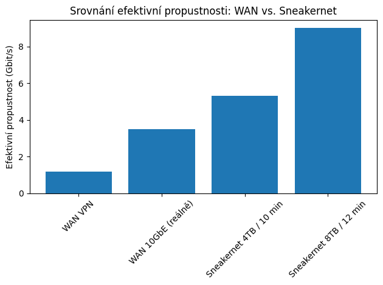

# Sneakernet jako deterministická fyzická přenosová architektura ve vysoce objemových datových scénářích
---
*Publikováno 13. 2. 2026*

**Síťařík**  
Nezávislý výzkumník distribuovaných systémů  
Únor 2026

---
## Abstrakt

Tento článek analyzuje Sneakernet jako fyzickou, člověkem asistovanou přenosovou architekturu určenou pro vysokokapacitní a bezpečnostně citlivé scénáře. Studie ukazuje, že při přenosu velkých objemů dat na krátké a střední vzdálenosti dosahuje Sneakernet srovnatelných či vyšších efektivních přenosových rychlostí než tradiční síťové technologie, a to při zachování inherentní izolace od síťových hrozeb. Článek formálně popisuje architekturu, výkonnostní parametry, bezpečnostní model a škálovací vlastnosti této infrastruktury.

---
## Úvod

Současné síťové infrastruktury jsou postaveny na komplexní soustavě směrovacích protokolů, přepínacích technologií a závislostí na globálních službách. Historicky lze jejich kořeny vysledovat až k projektům jako ARPANET, které položily základy paketově orientované komunikace.

Navzdory technologickému pokroku zůstává přenos velmi objemných dat (řádově terabajty) výzvou, zejména v prostředích s omezenou konektivitou, přísnými bezpečnostními požadavky nebo vysokou latencí WAN spojení.

Sneakernet představuje alternativní přístup: místo přenosu dat sítí se přenáší samotné úložiště.

---
## Definice a konceptuální rámec

Sneakernet lze definovat jako:

> Fyzický přenos digitálních dat prostřednictvím přenosného média za asistence lidského operátora mezi dvěma výpočetními uzly.

Architektura se skládá ze tří základních prvků:

1. **Zdrojový uzel** – zařízení zapisující data na přenosné médium
2. **Přenosné médium** – fyzický nosič dat (např. USB flash disk, externí SSD)
3. **Cílový uzel** – zařízení přijímající data

Transportní vrstvu realizuje lidský operátor, jehož mobilita nahrazuje tradiční síťovou infrastrukturu.

---
## Výkonnostní analýza

### Teoretická propustnost

Efektivní přenosová rychlost Sneakernetu je funkcí:

- kapacity média (C),
- času fyzického přesunu (T),
- rychlosti zápisu a čtení – časy I/O operací (T_write, T_read).

Zjednodušeně lze efektivní propustnost vyjádřit jako:

**B_eff = C / (T + T_write + T_read)**

Například přenos 4 TB dat během 10 minut fyzického přesunu odpovídá efektivní přenosové rychlosti přibližně 5,3 Gbit/s, což v mnoha běžných podnikových prostředích překonává reálnou propustnost VPN spojení provozovaných například v infrastruktuře Amazon Web Services nebo Microsoft Azure.

### Latence

Latence je deterministická a přímo úměrná fyzické vzdálenosti. Na rozdíl od paketových sítí není ovlivněna:

- zahlcením směrovačů,
- kolizní doménou,
- směrovací konvergencí,
- kvalitou Wi-Fi signálu.

Latence je zde fyzikální konstanta závislá na rychlosti lidské chůze.

---
## Spolehlivost a integrita dat

Sneakernet vykazuje velmi nízkou míru ztráty dat za předpokladu:

- správného vysunutí média,
- absence mechanického poškození,
- základní procesní disciplíny.

Z pohledu integrity lze aplikovat standardní mechanismy:

- kontrolní součty,
- kryptografické hashe,
- šifrování dat.

Významnou vlastností je absence paketové fragmentace, retransmisí a směrovacích smyček.

---
## Bezpečnostní model

Sneakernet je přirozeně **air-gapped** – data nejsou během přenosu vystavena síťovým útokům.

Odolnost zahrnuje:

- imunitu vůči DDoS útokům,
- nemožnost BGP hijackingu,
- absenci DNS manipulace,
- nulovou expozici vůči síťovým skenerům.

Rizikem zůstávají:

- fyzická ztráta média,
- neautorizovaný přístup,
- lidský faktor.

Tyto hrozby jsou však dobře známé a řešitelné procesními a kryptografickými opatřeními.

---
## Škálovatelnost

### Horizontální škálování

Zvyšování kapacity je možné paralelizací přenosu prostřednictvím více operátorů a médií.

### Vertikální škálování

Navýšení kapacity jednoho přenosu lze realizovat použitím médií s vyšší kapacitou (např. víceterabajtové SSD).

V extrémních scénářích lze dosáhnout efektivní přenosové kapacity převyšující běžné páteřní spoje, pokud je tolerovatelná vyšší latence.

---
## Diskuse

Sneakernet je často vnímán jako nouzové řešení. Tato práce však ukazuje, že v určitých scénářích představuje:

- ekonomicky efektivní alternativu,
- bezpečnostně preferované řešení,
- výkonnostně konkurenceschopnou architekturu.

Zejména při jednorázových přenosech velmi objemných dat může být fyzický transport racionálnější než budování nebo pronájem vysokokapacitního spojení.

---
## Závěr

Sneakernet nepředstavuje relikt minulosti, ale specifický architektonický model, jehož vlastnosti jsou v určitých kontextech optimální.

V době, kdy síťová infrastruktura roste v komplexitě, zůstává fyzický přenos dat překvapivě přímočarým a spolehlivým řešením.

Budoucí výzkum může směřovat k formalizaci lidské transportní vrstvy, modelování její dostupnosti a optimalizaci trasování v rámci budov i kampusů.

---
## Návrh RFC

